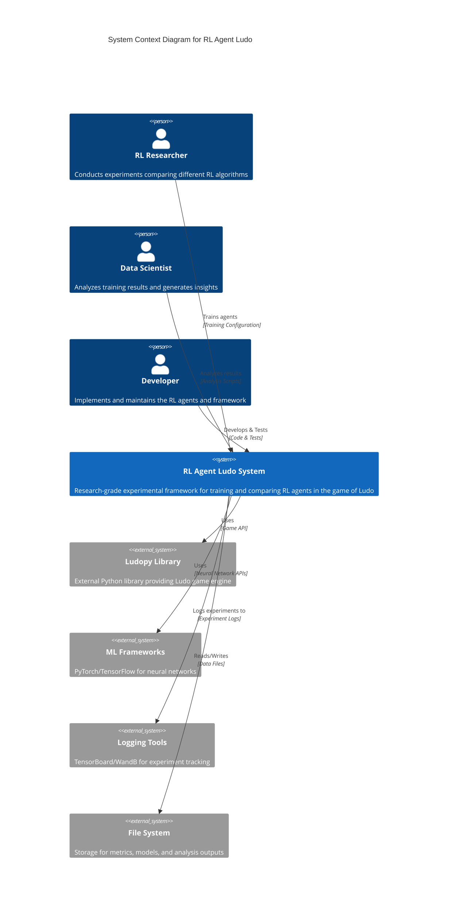

# C4 Model - Level 1: System Context

## Overview

The **System Context** diagram provides the highest level view of the RL Agent Ludo system, showing the system as a box in the center, surrounded by its users and the other systems that it interacts with.

---

## System Context Diagram

---

## Actors & Systems

### Human Actors

1. **RL Researcher**
   - **Role**: Primary user conducting experiments
   - **Interaction**: Trains different RL agents (Random, Q-Learning, DQN, PPO, MCTS)
   - **Goals**: Compare algorithm performance, analyze trade-offs, generate research insights

2. **Data Scientist**
   - **Role**: Analyzes training results
   - **Interaction**: Uses offline analysis scripts to generate reports and visualizations
   - **Goals**: Extract insights from 5-point analysis framework, create comparative reports

3. **Developer**
   - **Role**: Implements and maintains the system
   - **Interaction**: Writes code, runs tests, fixes bugs
   - **Goals**: Ensure code correctness, API stability, reproducibility

### External Systems

1. **Ludopy Library**
   - **Purpose**: Provides the Ludo game engine
   - **Interaction**: RL Agent Ludo uses it as the game backend
   - **Role**: External dependency (hardware abstraction layer)

2. **ML Frameworks** (PyTorch/TensorFlow)
   - **Purpose**: Neural network implementation for DQN, PPO, MCTS agents
   - **Interaction**: RL Agent Ludo uses them for function approximation
   - **Role**: External dependency

3. **Logging Tools** (TensorBoard/WandB)
   - **Purpose**: Experiment tracking and visualization
   - **Interaction**: RL Agent Ludo logs training metrics during experiments
   - **Role**: External service

4. **File System**
   - **Purpose**: Persistent storage
   - **Interaction**: Stores metrics (JSON/CSV), trained models, analysis outputs
   - **Role**: Infrastructure

---

## Key Interactions

### Training Workflow
1. **Researcher** → **RL Agent Ludo**: Configures experiment (agent type, hyperparameters)
2. **RL Agent Ludo** → **Ludopy**: Executes game steps
3. **RL Agent Ludo** → **ML Frameworks**: Trains neural networks (for DQN/PPO/MCTS)
4. **RL Agent Ludo** → **Logging Tools**: Streams training metrics
5. **RL Agent Ludo** → **File System**: Saves raw metrics data

### Analysis Workflow
1. **Data Scientist** → **RL Agent Ludo**: Runs offline analysis scripts
2. **RL Agent Ludo** → **File System**: Reads raw metrics data
3. **RL Agent Ludo** → **File System**: Generates analysis reports and plots

### Development Workflow
1. **Developer** → **RL Agent Ludo**: Implements features, writes tests
2. **RL Agent Ludo** → **File System**: Stores code and test results

---

## System Boundaries

The **RL Agent Ludo System** encompasses:
- ✅ Training orchestration and execution
- ✅ Agent implementations (Random, Tabular Q, TD(λ), DQN, PPO, MCTS)
- ✅ Environment abstraction layer
- ✅ Reward shaping strategies
- ✅ Metrics collection and storage
- ✅ Offline analysis and reporting

The system does **not** include:
- ❌ The game engine itself (provided by Ludopy)
- ❌ Neural network frameworks (external dependencies)
- ❌ Experiment logging services (external dependencies)
- ❌ File system infrastructure

---

## Next Level

See [C4 Level 2: Container Diagram](./c4-level2-container.md) for the technical building blocks within the system.

