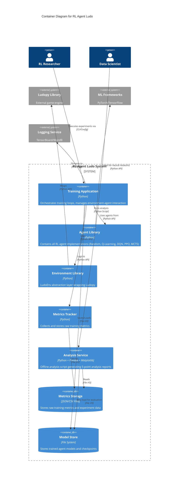

# C4 Model - Level 2: Container Diagram

## Overview

The **Container** diagram zooms into the system boundary, showing the high-level technical building blocks (applications, data stores, and file systems) and how they interact.

---

## Container Diagram



---

## Containers Overview

### 1. Training Application
- **Technology**: Python
- **Responsibility**: Main orchestrator for training workflows
- **Key Functions**:
  - Manages training loop execution
  - Coordinates environment-agent interactions
  - Handles on-policy vs off-policy training modes
  - Manages experiment configuration and seeding
- **Interactions**:
  - Uses Agent Library to instantiate and train agents
  - Uses Environment Library to manage game states
  - Logs metrics via Metrics Tracker
  - Streams experiment logs to external logging service
  - Saves trained models to Model Store

### 2. Agent Library
- **Technology**: Python (with optional PyTorch/TensorFlow)
- **Responsibility**: Contains all RL agent implementations
- **Key Functions**:
  - Provides abstract Agent interface
  - Implements concrete agents: Random, TabularQ, TD(λ), DQN, PPO, MCTS
  - Manages agent registry (factory pattern)
  - Handles agent lifecycle (act, learn, save/load)
- **Interactions**:
  - Used by Training Application
  - Uses ML Frameworks for neural network agents (DQN, PPO, MCTS)

### 3. Environment Library
- **Technology**: Python
- **Responsibility**: Hardware abstraction layer for Ludo game
- **Key Functions**:
  - Wraps Ludopy library with Gym-like interface
  - Provides state abstraction (full_vector, abstract_state)
  - Manages game state transitions
  - Handles opponent agents and curriculum learning
- **Interactions**:
  - Used by Training Application
  - Wraps Ludopy Library as external dependency

### 4. Metrics Tracker
- **Technology**: Python (lightweight, no pandas/matplotlib)
- **Responsibility**: Collects and stores raw training metrics
- **Key Functions**:
  - Collects metrics during training (wins, losses, rewards, Q-values)
  - Stores data in lightweight format (lists, dicts)
  - Exports to JSON/CSV files
- **Interactions**:
  - Receives metrics from Training Application
  - Writes to Metrics Storage

### 5. Analysis Service
- **Technology**: Python + Pandas + Matplotlib/Seaborn
- **Responsibility**: Offline analysis and reporting
- **Key Functions**:
  - Loads raw metrics from storage
  - Performs 5-point analysis framework
  - Generates comparative visualizations
  - Produces final research reports
- **Interactions**:
  - Reads from Metrics Storage
  - May load models from Model Store for evaluation

### 6. Metrics Storage
- **Technology**: JSON/CSV Files
- **Responsibility**: Persistent storage for training metrics
- **Data Stored**:
  - Episode-by-episode metrics
  - Win rates, convergence data
  - Reward statistics
  - Q-value distributions

### 7. Model Store
- **Technology**: File System
- **Responsibility**: Persistent storage for trained models
- **Data Stored**:
  - Neural network weights (for DQN, PPO, MCTS)
  - Q-tables (for TabularQ, TD(λ))
  - Training checkpoints

---

## Container Communication

### Training Flow
```
Researcher → Training App → Agent Library → ML Frameworks
                ↓
         Environment Library → Ludopy Library
                ↓
         Metrics Tracker → Metrics Storage
                ↓
         Logging Service (TensorBoard/WandB)
```

### Analysis Flow
```
Data Scientist → Analysis Service → Metrics Storage
                        ↓
                   Analysis Reports
```

---

## Technology Decisions

1. **Python**: Primary language for all containers
   - Reason: Standard for RL research, extensive ML libraries

2. **Separation of Metrics Collection and Analysis**:
   - Reason: Keeps training loop lightweight, allows offline analysis flexibility

3. **File-based Storage** (JSON/CSV):
   - Reason: Simple, portable, no database infrastructure needed for research

4. **External ML Frameworks** (PyTorch/TensorFlow):
   - Reason: Industry standard, well-tested, GPU support

5. **External Logging** (TensorBoard/WandB):
   - Reason: Standard tooling for experiment tracking in ML research

---

## Container Responsibilities Mapping

| Container | Maps to Implementation Plan |
|-----------|---------------------------|
| Training Application | Pillar 5: Trainer (Orchestrator) |
| Agent Library | Pillar 3: Agent (Interface) & AgentRegistry |
| Environment Library | Pillar 1: LudoEnv (HAL) + Pillar 1.5: State (DTO) |
| Metrics Tracker | Pillar 4: MetricsTracker (Data Collection) |
| Analysis Service | Pillar 4: analysis.py (Offline Analysis) |
| Metrics Storage | Pillar 4: JSON/CSV Files |
| Model Store | N/A (implied in plan) |

Note: **Pillar 2 (RewardShaper)** and **Pillar 6 (pytest)** are components within containers, shown in Level 3 diagrams.

---

## Next Level

See [C4 Level 3: Component Diagrams](./c4-level3-components.md) for the internal structure of each container.

