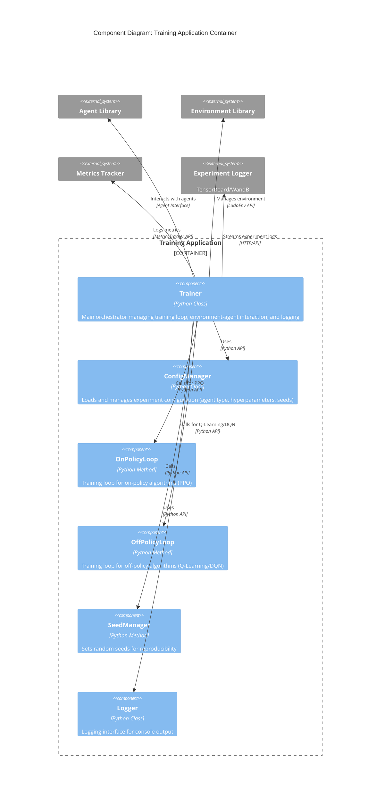
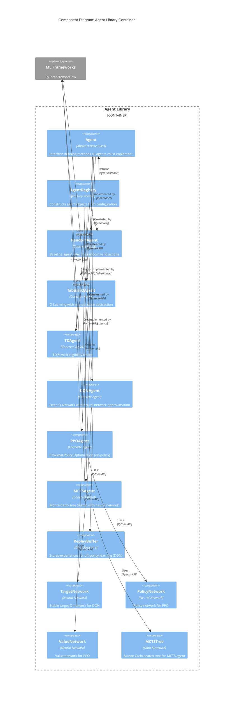
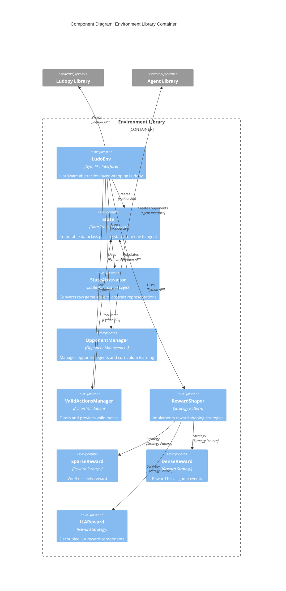
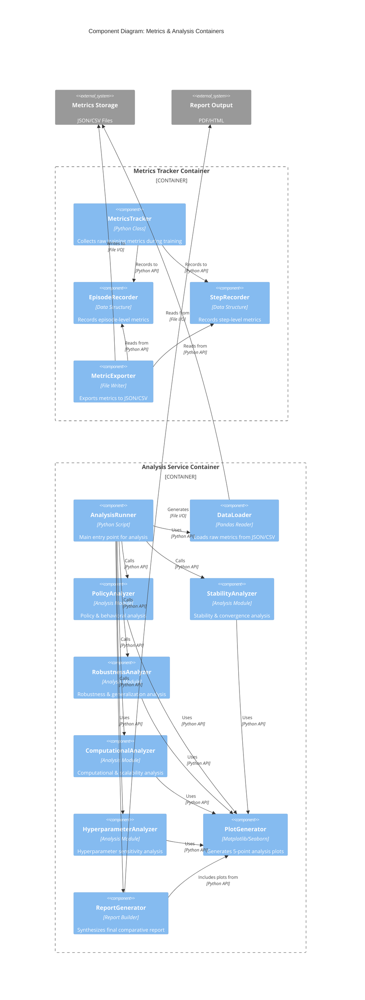

# C4 Model - Level 3: Component Diagrams

## Overview

The **Component** diagrams zoom into individual containers, showing the components within them and how they interact. This document contains component diagrams for all major containers in the RL Agent Ludo system.

---

## 1. Training Application Container - Components



### Training Application Components

| Component | Responsibility | Key Methods/Attributes |
|-----------|---------------|----------------------|
| **Trainer** | Main orchestrator | `run()`, `env`, `agent`, `config`, `logger`, `experiment_logger` |
| **ConfigManager** | Configuration loading | `load_config()`, `get_agent_config()`, `get_training_config()` |
| **OnPolicyLoop** | On-policy training logic | `_run_on_policy_loop()`, handles PPO-style learning |
| **OffPolicyLoop** | Off-policy training logic | `_run_off_policy_loop()`, handles Q-Learning/DQN-style learning |
| **SeedManager** | Reproducibility | `_set_seeds()`, sets Python/Numpy/PyTorch seeds |
| **Logger** | Console logging | `info()`, `warning()`, `error()`, `debug()` |

---

## 2. Agent Library Container - Components



### Agent Library Components

| Component | Responsibility | Key Methods/Attributes |
|-----------|---------------|----------------------|
| **Agent** | Abstract interface | `act()`, `learn_from_replay()`, `learn_from_rollout()`, `push_to_replay_buffer()`, `is_on_policy`, `needs_replay_learning` |
| **AgentRegistry** | Factory pattern | `create_agent(config)`, registers agent types |
| **RandomAgent** | Baseline | `act(state)` → random valid action |
| **TabularQAgent** | Q-Learning | `act()`, `learn_from_replay()`, Q-table, `alpha`, `gamma`, `epsilon` |
| **TDAgent** | TD(λ) | `act()`, `learn_from_replay()`, eligibility traces, `lambda` |
| **DQNAgent** | Deep Q-Network | `act()`, `learn_from_replay()`, `push_to_replay_buffer()`, replay buffer, target network |
| **PPOAgent** | Proximal Policy Optimization | `act()`, `learn_from_rollout()`, policy network, value network, `clip_range` |
| **MCTSAgent** | Monte-Carlo Tree Search | `act()`, `learn_from_rollout()`, MCTS tree, neural network evaluator |

---

## 3. Environment Library Container - Components



### Environment Library Components

| Component | Responsibility | Key Methods/Attributes |
|-----------|---------------|----------------------|
| **LudoEnv** | HAL abstraction | `reset()`, `step()`, `get_valid_actions()`, `game`, `opponent_agents`, `opponent_schedule`, `player_id_map` |
| **State** | Immutable DTO | `full_vector` (NumPy array), `abstract_state` (hashable tuple), `valid_moves` (list), `dice_roll` (int) |
| **StateAbstractor** | State conversion | `_get_full_state_vector()`, `_get_abstract_state()`, `_get_observation()` |
| **OpponentManager** | Opponent handling | Manages `opponent_agents` list, `opponent_schedule` for curriculum learning |
| **ValidActionsManager** | Action filtering | `get_valid_actions()`, filters moves based on game rules |
| **RewardShaper** | Reward strategy | `get_reward(game_events)` → (reward, ila_components), `schema` |
| **SparseReward** | Sparse strategy | Reward only on win/loss |
| **DenseReward** | Dense strategy | Reward for piece moves, captures, home entry, etc. |
| **ILAReward** | ILA strategy | Decoupled individual learning algorithm components |

---

## 4. Metrics & Analysis Container - Components



### Metrics & Analysis Components

#### Metrics Tracker Components

| Component | Responsibility | Key Methods/Attributes |
|-----------|---------------|----------------------|
| **MetricsTracker** | Main collector | `log_metrics()`, `save_metrics()`, lightweight (no pandas) |
| **EpisodeRecorder** | Episode data | Lists/dicts storing episode-level metrics |
| **StepRecorder** | Step data | Lists/dicts storing step-level metrics |
| **MetricExporter** | File export | `export_to_json()`, `export_to_csv()` |

#### Analysis Service Components

| Component | Responsibility | Key Methods/Attributes |
|-----------|---------------|----------------------|
| **AnalysisRunner** | Main script | `run_analysis()`, orchestrates 5-point analysis |
| **DataLoader** | Data loading | `load_metrics()`, pandas DataFrame creation |
| **PolicyAnalyzer** | Policy analysis | Aggression, defense, efficiency metrics |
| **StabilityAnalyzer** | Stability analysis | Q-value variance, win-rate CI, convergence curves |
| **RobustnessAnalyzer** | Robustness analysis | Opponent swap test, IQL flaw detection, generalization |
| **ComputationalAnalyzer** | Computational analysis | Sample efficiency, inference time, memory usage |
| **HyperparameterAnalyzer** | Hparam sensitivity | Win rate vs. hyperparameter plots |
| **PlotGenerator** | Visualization | Matplotlib/Seaborn plot generation |
| **ReportGenerator** | Report synthesis | Final comparative report generation |

---

## Component Interaction Summary

### Training Flow
```
Trainer → LudoEnv → State → Agent
    ↓
RewardShaper → Reward
    ↓
MetricsTracker → Metrics Storage
```

### Learning Flow
```
Agent.act(State) → Action
LudoEnv.step(Action) → (State, Reward)
    ↓
Agent.learn_from_replay() OR Agent.learn_from_rollout()
```

### Analysis Flow
```
DataLoader → Raw Metrics
    ↓
5 Analyzers → Insights
    ↓
PlotGenerator → Visualizations
    ↓
ReportGenerator → Final Report
```

---

## Next Level

See [C4 Level 4: Code Diagrams](./c4-level4-code.md) for code-level interactions and sequence diagrams for specific scenarios.

