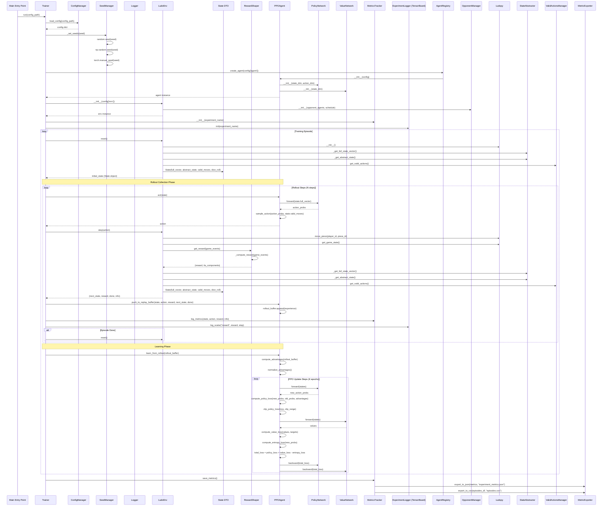
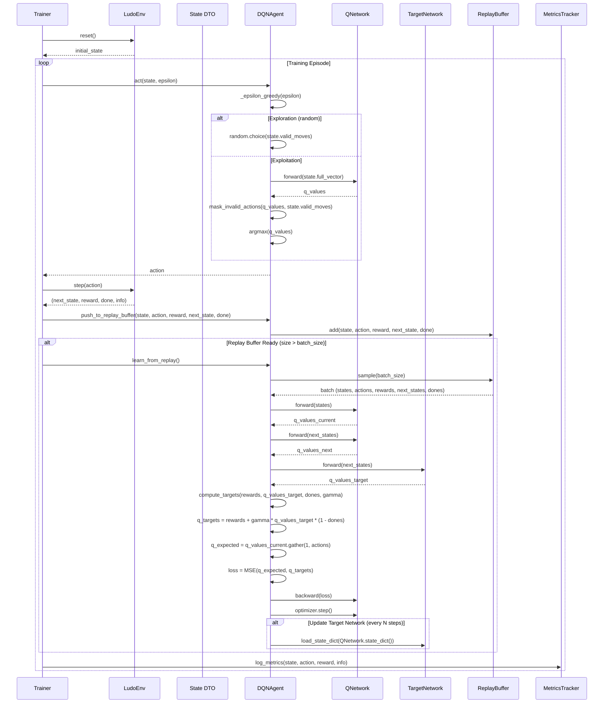
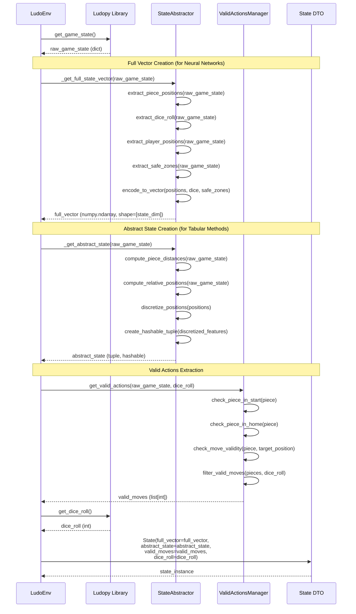
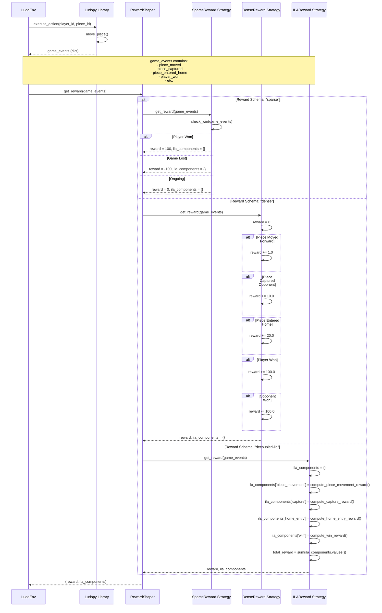
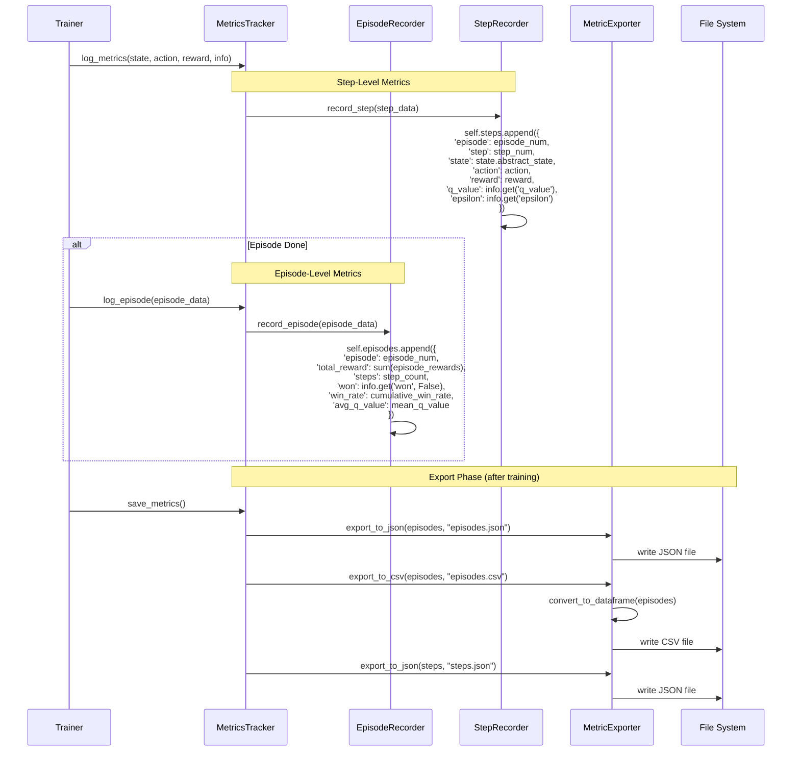
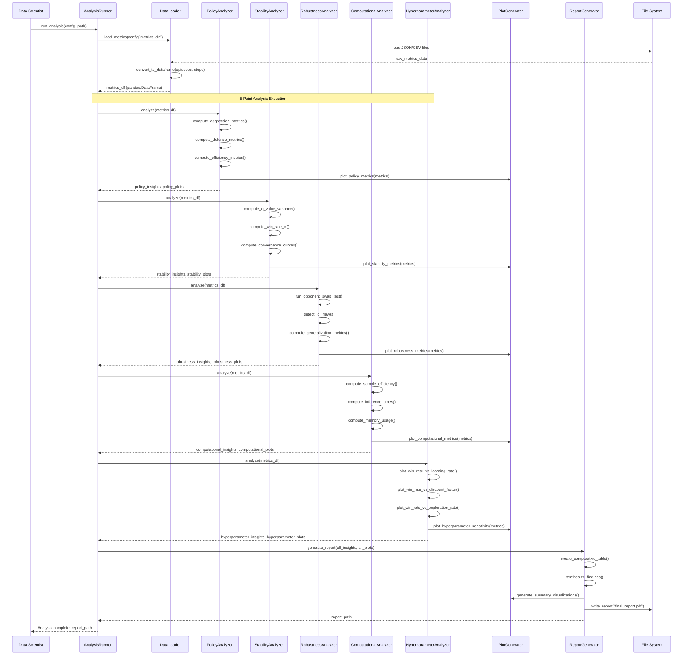

# C4 Model - Level 4: Code Diagrams

## Overview

The **Code** diagrams show the internal structure of components, including classes, methods, functions, and their interactions. This level is the most granular and shows how code actually executes for specific scenarios.

---

## Scenario 1: On-Policy Training Loop (PPO Agent)

### Sequence Diagram: On-Policy Training Episode



### Code-Level Class Structure: PPOAgent

```python
class PPOAgent(Agent):
    def __init__(self, config):
        self.is_on_policy = True
        self.needs_replay_learning = False
        self.policy_network = PolicyNetwork(state_dim, action_dim)
        self.value_network = ValueNetwork(state_dim)
        self.rollout_buffer = []
        self.clip_range = config['clip_range']
        self.gamma = config['gamma']
        self.gae_lambda = config['gae_lambda']
    
    def act(self, state: State) -> int:
        state_vector = state.full_vector
        action_probs = self.policy_network.forward(state_vector)
        return self._sample_action(action_probs, state.valid_moves)
    
    def learn_from_rollout(self, rollout_buffer: List[Experience]):
        advantages = self._compute_advantages(rollout_buffer)
        normalized_advantages = self._normalize(advantages)
        
        for epoch in range(self.n_epochs):
            policy_loss = self._compute_policy_loss(rollout_buffer, normalized_advantages)
            value_loss = self._compute_value_loss(rollout_buffer)
            entropy_loss = self._compute_entropy_loss(rollout_buffer)
            
            total_loss = policy_loss + self.value_coef * value_loss - self.entropy_coef * entropy_loss
            self._update_networks(total_loss)
```

---

## Scenario 2: Off-Policy Training Loop (DQN Agent)

### Sequence Diagram: Off-Policy Training with Experience Replay



### Code-Level Class Structure: DQNAgent

```python
class DQNAgent(Agent):
    def __init__(self, config):
        self.is_on_policy = False
        self.needs_replay_learning = True
        self.q_network = QNetwork(state_dim, action_dim)
        self.target_network = QNetwork(state_dim, action_dim)
        self.replay_buffer = ReplayBuffer(capacity=config['buffer_size'])
        self.gamma = config['gamma']
        self.epsilon = config['epsilon_start']
        self.epsilon_decay = config['epsilon_decay']
        self.target_update_freq = config['target_update_freq']
    
    def act(self, state: State, epsilon: float) -> int:
        if random.random() < epsilon:
            return random.choice(state.valid_moves)
        else:
            q_values = self.q_network.forward(state.full_vector)
            masked_q = self._mask_invalid_actions(q_values, state.valid_moves)
            return masked_q.argmax().item()
    
    def push_to_replay_buffer(self, state, action, reward, next_state, done):
        self.replay_buffer.add(state, action, reward, next_state, done)
    
    def learn_from_replay(self):
        if len(self.replay_buffer) < self.batch_size:
            return
        
        batch = self.replay_buffer.sample(self.batch_size)
        states, actions, rewards, next_states, dones = batch
        
        q_current = self.q_network.forward(states).gather(1, actions)
        q_next = self.target_network.forward(next_states).max(1)[0].detach()
        q_targets = rewards + self.gamma * q_next * (1 - dones)
        
        loss = F.mse_loss(q_current, q_targets.unsqueeze(1))
        self._update_network(loss)
        
        if self.step_count % self.target_update_freq == 0:
            self._update_target_network()
```

---

## Scenario 3: State Abstraction Process

### Sequence Diagram: State Creation and Abstraction



### Code-Level Class Structure: StateAbstractor

```python
@dataclass(frozen=True)
class State:
    full_vector: np.ndarray  # For neural networks
    abstract_state: tuple    # For tabular methods (hashable)
    valid_moves: List[int]   # List of valid action indices
    dice_roll: int           # Current dice roll

class StateAbstractor:
    def __init__(self, state_dim: int, discretization_levels: int):
        self.state_dim = state_dim
        self.discretization_levels = discretization_levels
    
    def _get_full_state_vector(self, raw_game_state: dict) -> np.ndarray:
        """Creates continuous state vector for neural networks."""
        features = []
        
        # Extract piece positions (4 players × 4 pieces = 16 positions)
        for player_id in range(4):
            for piece_id in range(4):
                position = raw_game_state['pieces'][player_id][piece_id]
                features.extend([position, self._is_in_safe_zone(position)])
        
        # Extract dice roll
        features.append(raw_game_state['dice_roll'])
        
        # Extract game phase indicators
        features.append(raw_game_state['current_player'])
        features.extend(self._get_player_progress(raw_game_state))
        
        return np.array(features, dtype=np.float32)
    
    def _get_abstract_state(self, raw_game_state: dict) -> tuple:
        """Creates discrete, hashable state for tabular methods."""
        # Discretize piece positions
        discretized = []
        for player_id in range(4):
            player_pieces = []
            for piece_id in range(4):
                position = raw_game_state['pieces'][player_id][piece_id]
                # Discretize to bins: [0-15, 16-31, 32-47, 48-63, home, start]
                if position == -1:  # Start
                    discrete_pos = -1
                elif position == 999:  # Home
                    discrete_pos = 999
                else:
                    discrete_pos = position // self.discretization_levels
                player_pieces.append(discrete_pos)
            discretized.append(tuple(sorted(player_pieces)))
        
        # Add dice roll and current player
        discretized.append(raw_game_state['dice_roll'])
        discretized.append(raw_game_state['current_player'])
        
        return tuple(discretized)
```

---

## Scenario 4: Reward Shaping Process

### Sequence Diagram: Reward Calculation with Strategy Pattern



### Code-Level Class Structure: RewardShaper

```python
class RewardShaper(ABC):
    @abstractmethod
    def get_reward(self, game_events: dict) -> tuple[float, dict]:
        """Returns (net_reward, ila_components_dict)."""
        pass

class SparseReward(RewardShaper):
    def get_reward(self, game_events: dict) -> tuple[float, dict]:
        if game_events.get('player_won'):
            return 100.0, {}
        elif game_events.get('opponent_won'):
            return -100.0, {}
        else:
            return 0.0, {}

class DenseReward(RewardShaper):
    def get_reward(self, game_events: dict) -> tuple[float, dict]:
        reward = 0.0
        
        if game_events.get('piece_moved'):
            reward += 1.0
        
        if game_events.get('piece_captured'):
            reward += 10.0
        
        if game_events.get('piece_entered_home'):
            reward += 20.0
        
        if game_events.get('player_won'):
            reward += 100.0
        elif game_events.get('opponent_won'):
            reward -= 100.0
        
        return reward, {}

class ILAReward(RewardShaper):
    def get_reward(self, game_events: dict) -> tuple[float, dict]:
        ila_components = {
            'piece_movement': self._compute_movement_reward(game_events),
            'capture': self._compute_capture_reward(game_events),
            'home_entry': self._compute_home_entry_reward(game_events),
            'win': self._compute_win_reward(game_events),
        }
        
        total_reward = sum(ila_components.values())
        return total_reward, ila_components

class RewardShaperFactory:
    @staticmethod
    def create(schema: str) -> RewardShaper:
        strategies = {
            'sparse': SparseReward,
            'dense': DenseReward,
            'decoupled-ila': ILAReward,
        }
        return strategies[schema]()
```

---

## Scenario 5: Metrics Collection Process

### Sequence Diagram: Metrics Logging and Export



### Code-Level Class Structure: MetricsTracker

```python
class MetricsTracker:
    def __init__(self, experiment_name: str):
        self.experiment_name = experiment_name
        self.episode_recorder = EpisodeRecorder()
        self.step_recorder = StepRecorder()
        self.exporter = MetricExporter()
        self.current_episode = 0
        self.current_step = 0
    
    def log_metrics(self, state: State, action: int, reward: float, info: dict):
        step_data = {
            'episode': self.current_episode,
            'step': self.current_step,
            'state': state.abstract_state,
            'action': action,
            'reward': reward,
            **info  # q_value, epsilon, etc.
        }
        self.step_recorder.record_step(step_data)
        self.current_step += 1
    
    def log_episode(self, episode_data: dict):
        episode_data['episode'] = self.current_episode
        self.episode_recorder.record_episode(episode_data)
        self.current_episode += 1
        self.current_step = 0
    
    def save_metrics(self, output_dir: str = "results"):
        os.makedirs(output_dir, exist_ok=True)
        
        # Export episodes
        self.exporter.export_to_json(
            self.episode_recorder.episodes,
            f"{output_dir}/{self.experiment_name}_episodes.json"
        )
        self.exporter.export_to_csv(
            self.episode_recorder.episodes,
            f"{output_dir}/{self.experiment_name}_episodes.csv"
        )
        
        # Export steps (optional, can be large)
        if self.step_recorder.steps:
            self.exporter.export_to_json(
                self.step_recorder.steps,
                f"{output_dir}/{self.experiment_name}_steps.json"
            )

class EpisodeRecorder:
    def __init__(self):
        self.episodes = []
    
    def record_episode(self, episode_data: dict):
        self.episodes.append(episode_data)

class StepRecorder:
    def __init__(self):
        self.steps = []
    
    def record_step(self, step_data: dict):
        self.steps.append(step_data)

class MetricExporter:
    @staticmethod
    def export_to_json(data: list, filepath: str):
        with open(filepath, 'w') as f:
            json.dump(data, f, indent=2)
    
    @staticmethod
    def export_to_csv(data: list, filepath: str):
        # Convert dict list to CSV (minimal pandas usage in actual implementation)
        df = pd.DataFrame(data)
        df.to_csv(filepath, index=False)
```

---

## Scenario 6: Analysis Execution Process

### Sequence Diagram: 5-Point Analysis Framework



### Code-Level Function Structure: AnalysisRunner

```python
class AnalysisRunner:
    def __init__(self, config: dict):
        self.config = config
        self.data_loader = DataLoader()
        self.analyzers = {
            'policy': PolicyAnalyzer(),
            'stability': StabilityAnalyzer(),
            'robustness': RobustnessAnalyzer(),
            'computational': ComputationalAnalyzer(),
            'hyperparameter': HyperparameterAnalyzer(),
        }
        self.plot_generator = PlotGenerator()
        self.report_generator = ReportGenerator()
    
    def run_analysis(self, metrics_dir: str):
        # Load data
        metrics_df = self.data_loader.load_metrics(metrics_dir)
        
        # Run 5-point analysis
        all_insights = {}
        all_plots = {}
        
        for analyzer_name, analyzer in self.analyzers.items():
            insights, plots = analyzer.analyze(metrics_df)
            all_insights[analyzer_name] = insights
            all_plots[analyzer_name] = plots
        
        # Generate report
        report_path = self.report_generator.generate_report(
            all_insights, all_plots, output_dir=self.config['output_dir']
        )
        
        return report_path

class PolicyAnalyzer:
    def analyze(self, metrics_df: pd.DataFrame) -> tuple[dict, list]:
        insights = {
            'aggression_score': self._compute_aggression_score(metrics_df),
            'defense_score': self._compute_defense_score(metrics_df),
            'efficiency_score': self._compute_efficiency_score(metrics_df),
        }
        
        plots = [
            self.plot_generator.plot_aggression_over_time(metrics_df),
            self.plot_generator.plot_defense_over_time(metrics_df),
            self.plot_generator.plot_efficiency_over_time(metrics_df),
        ]
        
        return insights, plots
```

---

## Code-Level Class Relationships

### Agent Interface Hierarchy

```python
# Abstract base class
class Agent(ABC):
    @property
    @abstractmethod
    def is_on_policy(self) -> bool:
        pass
    
    @property
    @abstractmethod
    def needs_replay_learning(self) -> bool:
        pass
    
    @abstractmethod
    def act(self, state: State) -> int:
        pass
    
    @abstractmethod
    def learn_from_replay(self, *args):
        pass
    
    @abstractmethod
    def learn_from_rollout(self, *args):
        pass
    
    @abstractmethod
    def push_to_replay_buffer(self, *args):
        pass

# Concrete implementations
class RandomAgent(Agent):
    is_on_policy = False
    needs_replay_learning = False

class TabularQAgent(Agent):
    is_on_policy = False
    needs_replay_learning = True

class TDAgent(Agent):
    is_on_policy = False
    needs_replay_learning = True

class DQNAgent(Agent):
    is_on_policy = False
    needs_replay_learning = True

class PPOAgent(Agent):
    is_on_policy = True
    needs_replay_learning = False

class MCTSAgent(Agent):
    is_on_policy = True
    needs_replay_learning = False
```

---

## Summary

This Level 4 code diagram shows:

1. **Detailed sequence diagrams** for key scenarios:
   - On-policy training (PPO)
   - Off-policy training (DQN)
   - State abstraction process
   - Reward shaping with strategy pattern
   - Metrics collection and export
   - 5-point analysis execution

2. **Code-level class structures** showing:
   - Class attributes and methods
   - Method signatures
   - Implementation details

3. **Function call flows** showing:
   - Exact method invocations
   - Parameter passing
   - Return values

These diagrams provide the granular detail needed to understand how the code actually executes and how components interact at the implementation level.

---

## Navigation

- [C4 Level 1: System Context](./c4-level1-context.md)
- [C4 Level 2: Container Diagram](./c4-level2-container.md)
- [C4 Level 3: Component Diagrams](./c4-level3-components.md)
- **C4 Level 4: Code Diagrams** (this document)

